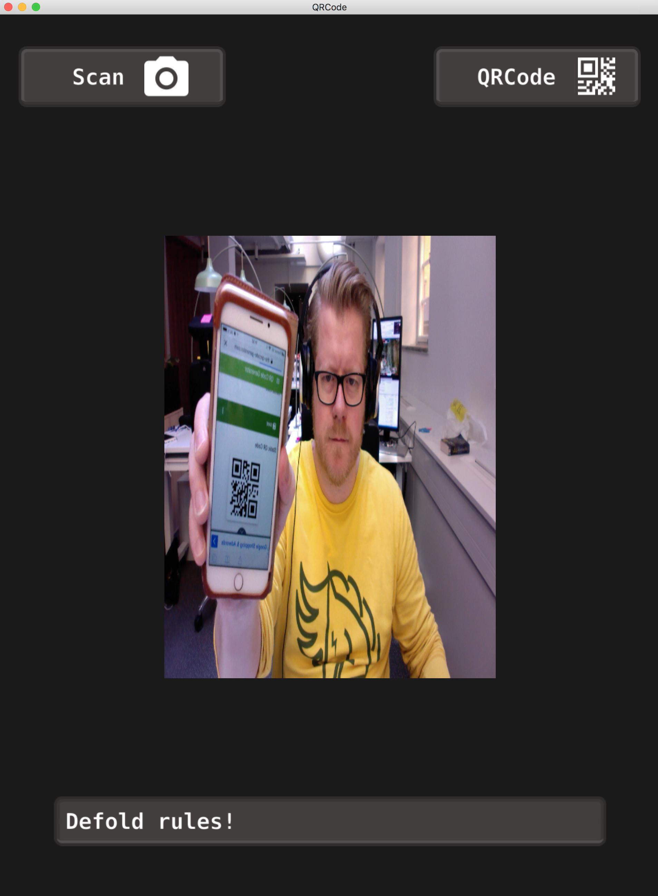
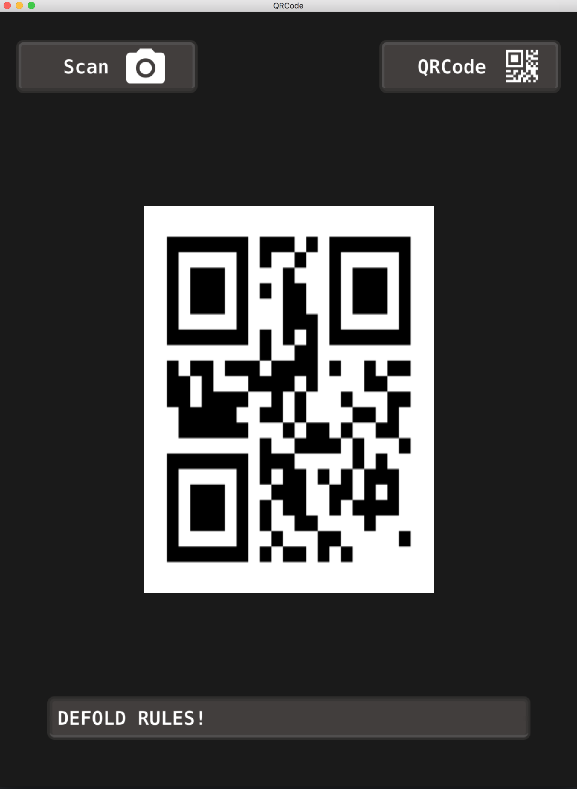

# QRCode

A small extension to encode and decode QR codes.
It relies on [buffers](https://www.defold.com/ref/buffer/).

For the supported set of QRCodes to decode, see the documentation for [Quirc decoded](https://github.com/dlbeer/quirc)
The encoder supports the traditional QR code type.

# Example app

Push the Scan button to start scanning for qrcodes. The camera starts running and the the app scans the
camera image for the first qrcode. Similarly, push the QRCode button to create a qrcode:
 

# Lua api:

## qrcode.scan(buffer, width, height, flip_x) -> string

Scans an image buffer for any qrcode.

  `buffer` An image buffer where the first stream must be of format `UINT8` * 3, and have the dimensions width*height

  `width` The width of the image, in texels

  `height` The height of the image, in texels

  `flip_x` A boolean flag that tells the decoder to flip the image in X first.

  -> `string` Returns a the text from the qrcode if successful. Returns nil otherwise

## qrcode.generate(text) -> buffer, size

Generates a qrcode in the form of a buffer of format: name = 'data', type = `UINT8` * 1, and dimensions `size` * `size`

  `text` The text that needs decoding. The maximum text length is dependent on the [input data](http://www.qrcode.com/en/about/version.html). Kanji is currently not supported specifically, but will be treated as `bytes`

  -> `buffer` An image buffer of dimensions `size` * `size`. The stream name is `data` and the type+count is `UINT8` * 1

  -> `size` The size of one side of the image

# Credits:

## Decoder

https://github.com/dlbeer/quirc

## Encoder

https://github.com/JCash/qrcode

I also use this site to create test images:
https://www.the-qrcode-generator.com/